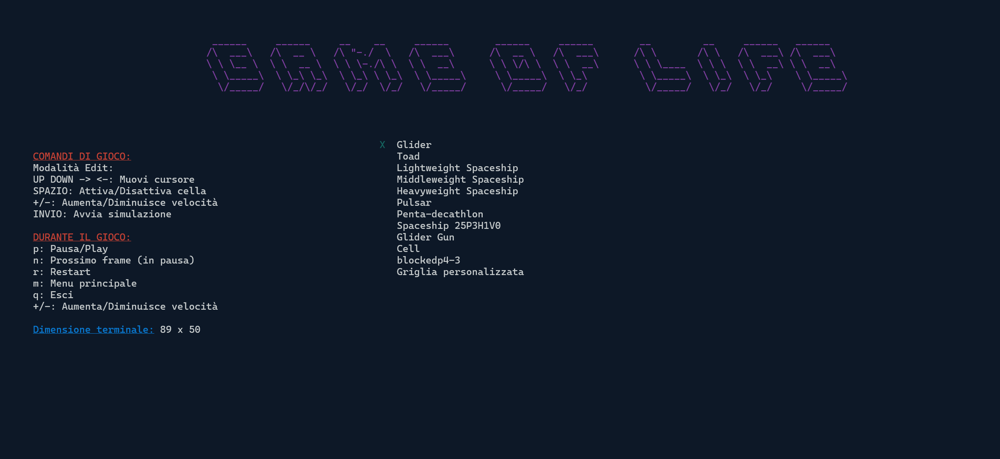

# 🎮 Game Of Life nel Tuo Terminale

Una versione di Conway's Game of Life nel proprio terminale scritta interamente in C, grafica realizzata grazie alla libreria ncurses.


## 📹 Video dimostrativo

Ecco un video dimostrativo del gioco in azione:


## 📑 Indice

- [🔧 Funzionamento](#funzionamento)
- [🎮 Come giocare](#come-giocare)
- [📋 Regole del Gioco di Conway](#regole-del-gioco-di-conway)
- [🐛 Bug](#bug)
- [📜 Licenza](#licenza)

## 🔧 Funzionamento

Per una descrizione più dettagliata del codice vedere [`main.c`](main.c).

L'algoritmo opera nel seguente modo:

-  La funzione **`main`** si occupa di chiamare le funzioni principali:
    -  Inizializzazione della libreria ncurses.
    -  Disabilitazione dell'echo dei tasti per evitare che venga mostrato a schermo l'input.
    -  Inizializzazione del cursore.
    -  Avvio del menu di gioco.
    -  Chiusura di ncurses con terminazione del programma.

-  **`show_menu`** inizializza i colori personalizzati per la schermata di gioco, stampa a schermo il titolo, i comandi e i vari template tra cui scegliere. È possibile scegliere anche di costruire una griglia con dimensioni personalizzate che non potranno sforare le dimensioni attuali del terminale.

-  Dopo aver selezionato la propria scelta vengono allocate due griglie in memoria: quella attuale che verrà mostrata e la successiva. Ciò permette di far visualizzare a schermo lo stato attuale della griglia e nel mentre calcolare lo stato successivo.

-  Se è stata scelta la griglia personalizzata verrà richiesto all'utente di inserire le dimensioni.

- In entrambi i casi si entrerà in **✏️ `edit_mode`** e poi si avvierà la simulazione con il **`game_loop`**.

- In **✏️ `edit_mode`**, mediante un ciclo `while` che non termina e uno `switch` per i comandi, è possibile:
    -  Spostare il cursore nella griglia.
    -  Attivare e disattivare le celle.
    -  Tornare al menu.
    -  Modificare la velocità del gioco.
    -  Avviare il `game_loop`.

- Nel **🔄 `game_loop`**, in modo simile all'`edit_mode`, è possibile:
    -  Modificare la velocità di gioco.
    -  Tornare al menu.
    -  Terminare il programma.
    -  Mettere in pausa.
    -  Fare il restart della simulazione.

    Per fare ciò è utilizzata una variabile di supporto per salvare la configurazione della griglia prima di avviare la simulazione. Se la simulazione è in pausa è possibile passare al frame successivo.

- Se la simulazione non è in pausa, calcolerà la griglia successiva tenendo conto di tutte le regole del Gioco originale e successivamente disegna la griglia.

## 🎮 Come giocare

### 🛠️ Compila il programma

```bash
gcc main.c -o game_of_life -lncurses
```

### Esegui il programma con il seguente comando

```bash
./game_of_life
```

**Nota**: Il programma potrebbe modificare momentaneamente anche i colori del terminale una volta terminato. Basterà aprire un nuovo terminale.

**Nota**: Le posizioni delle scritte nel menu sono state ottimizzate per poter essere più centrate possibile senza accavallarsi. Se la schermata del menu non è simile a questa allora chiudere il programma, ingrandire il terminale oppure eseguire il comando `ctrl + -` e riavviarlo:



**Nota**: Se verrà ridimensionato il terminale durante l'esecuzione del programma potrebbero presentarsi bug grafici, sarà necessario terminare e rieseguire il processo.

### Comandi di gioco

**Menu:**

- `UP` `DOWN`: Muovi cursore
- `INVIO`: Seleziona lo scenario

**Modalità edit:**

- `UP` `DOWN` `←` `→`: Muovi cursore
- `SPAZIO`: Attiva/Disattiva cella
- `+`/`-`: Aumenta/Diminuisce velocità
- `INVIO`: Avvia la simulazione
- `m`: Torna al menu

**Durante la simulazione:**

- `p`: Pausa/Play
- `n`: Prossimo frame (in pausa)
- `r`: Restart
- `m`: Menu principale
- `q`: Esci
- `+`/`-`: Aumenta/Diminuisce velocità

Nella modalità edit sarà visibile il cursore `"X"`, durante la simulazione no.

In alto a sinistra saranno mostrate varie informazioni relative a:

- Numero di generazione
- Popolazione
- Velocità di gioco (espressa in ms tra una generazione e la successiva)
- Due tipologie di coordinate: la posizione del cursore con centro `(0,0)` in alto a sinistra e esattamente centrata nella griglia.

## 📋 Regole del Gioco di Conway

Citando Wikipedia: [Gioco della vita](https://it.wikipedia.org/wiki/Gioco_della_vita)

> Si tratta in realtà di un gioco senza giocatori, intendendo che la sua evoluzione è determinata dal suo stato iniziale, senza necessità di alcun input da parte di giocatori umani. Si svolge su una griglia di caselle quadrate (celle) che si estende all'infinito in tutte le direzioni; questa griglia è detta mondo. Ogni cella ha 8 vicini, che sono le celle ad essa adiacenti, includendo quelle in senso diagonale. Ogni cella può trovarsi in due stati: viva o morta (o accesa e spenta, on e off). Lo stato della griglia evolve in intervalli di tempo discreti, cioè scanditi in maniera netta. Gli stati di tutte le celle in un dato istante sono usati per calcolare lo stato delle celle all'istante successivo. Tutte le celle del mondo vengono quindi aggiornate simultaneamente nel passaggio da un istante a quello successivo: passa così una generazione.

Le transizioni dipendono unicamente dallo stato delle celle vicine in quella generazione:

1. **Solitari**: Qualsiasi cella viva con meno di due celle vive adiacenti muore, come per effetto d'isolamento.
2. **Sopravvivenza**: Qualsiasi cella viva con due o tre celle vive adiacenti sopravvive alla generazione successiva.
3. **Sovrappopolazione**: Qualsiasi cella viva con più di tre celle vive adiacenti muore, come per effetto di sovrappopolazione.
4. **Riproduzione**: Qualsiasi cella morta con esattamente tre celle vive adiacenti diventa una cella viva, come per effetto di riproduzione.

## 🐛 Bug

- Il cursore `"X"` dopo il restart non è visibile.
- Se si carica un template, si torna al menu e si seleziona griglia personalizzata il programma termina.

## 📜 Licenza

Questo progetto è concesso in licenza sotto la Licenza MIT. Vedi il file [LICENSE](LICENSE) per i dettagli.